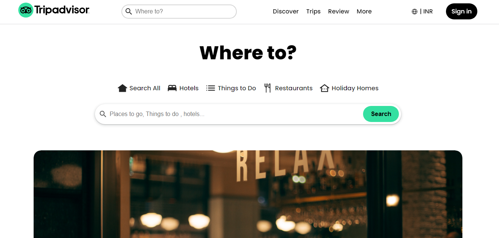
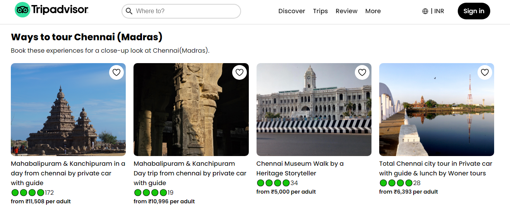

# TripAdvisor Clone

## Overview

Welcome to the TripAdvisor Clone, a user interface (UI) project that replicates the popular travel platform's look and feel. This project was created using HTML and CSS, showcasing the ability to design and structure a website with clean and responsive layouts.

## Features

- **Intuitive Design**: Familiar TripAdvisor-style interface for easy navigation.
- **Responsive Layouts**: Ensures a seamless user experience across various devices.
- **CSS Styling**: Custom styles crafted to closely match the original design.
- **Static Content**: Placeholder data to mimic the TripAdvisor experience.

## Getting Started

Follow these simple steps to get a copy of the project up and running on your local machine:

1. Clone the repository: `git clone https://github.com/MageshVachiravel/Tripadvisor-Clone.git`
2. Open the `index.html` file in your preferred web browser.

## Screenshots

## Contributing

If you'd like to contribute to the project, follow these steps:

1. Fork the repository.
2. Create a new branch: `git checkout -b feature/new-feature`.
3. Make your changes and commit them: `git commit -m 'Add new feature'`.
4. Push to the branch: `git push origin feature/new-feature`.
5. Open a pull request.

## Acknowledgments

- This project was inspired by the TripAdvisor website.
- Special thanks to `Agnel John` - (EMC) for their guidance and support.

Feel free to explore, modify, and contribute to make this TripAdvisor Clone even better!
